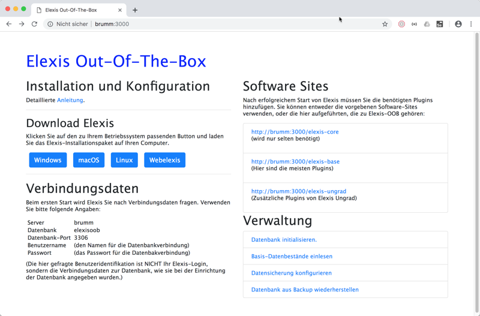
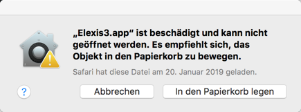
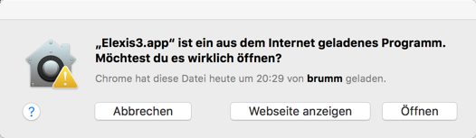
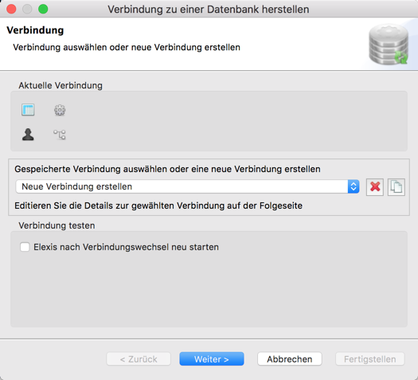
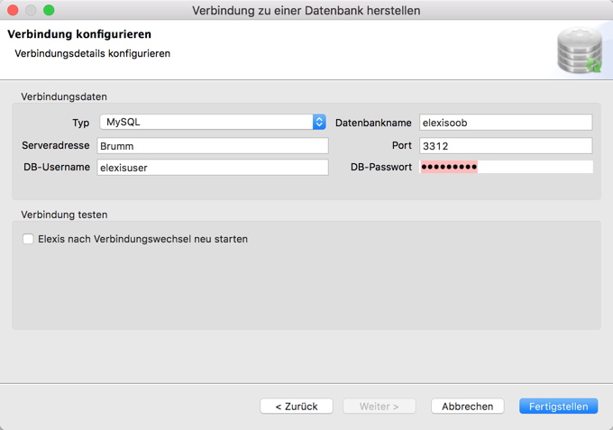
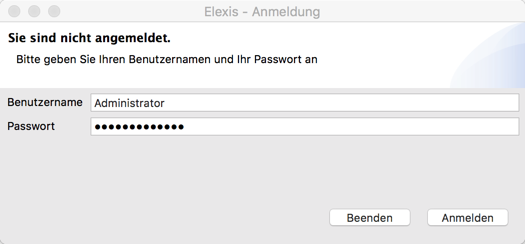
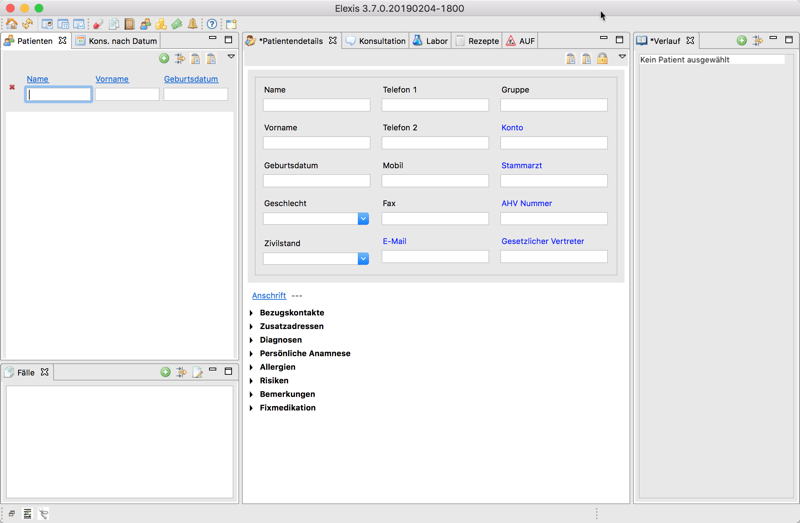

# Einrichtung der Elexis-Clients

Elexis läuft auf Windows, macOS und Linux-Computern. Einzige Vorbedingung: Eine [Java-Runtime](https://www.oracle.com/technetwork/java/javase/downloads/jre8-downloads-2133155.html) (Version 8 empfohlen) muss installiert sein. Am selben Server können ohne Weiteres auch gemischt Arbeitsplätze der verschiedenen Systeme angeschlossen werden.

Starten Sie auf dem gewünschten Arbeitsplatz einen Webbrowser (am besten Chrome oder Firefox) und richten Sie ihn auf <http://IhrServer:3000>. Klicken Sie unter 'Download Elexis' dann auf den Button, der dem Betriebssystem des aktuellen Clients entspricht.

Sie erhalten, je nach Betriebssytem 32- und 64-Bit-Varianten zur Auswahl vorgeschlagen. Laden Sie den passenden Client herunter. (Den Punkt "Webelexis" werden wir etwas später ansehen)

Den heruntergeladenen Client sollten Sie nun auf Ihrem System entpacken und starten. Auf dem Mac muss die entpackte App noch in den "Programme"-Ordner verschoben werden, damit sie später korrekt läuft. Trotzdem kommt dabei manchmal eine etwas skurrile Warnung, wie hier:

Nein, lieber Apple, das empfiehlt sich nicht. Stattdessen klickt man auf Apfel-&gt;Systemeinstellungen-&gt;Sicherheit und wählt auf der Seite “Allgemein” unten “Apps Download erlauben von” -&gt; “Keine Einschränkungen”. Dann startet man Elexis Ungrad noch einmal. Sobald es einmal gestartet wurde, kann man die Sicherheitseinstellungen wieder auf das zurückstellen, was vorher war. weitere Starts von Elexis sollten nun problemlos gehen.

Hinweis: Unter macOS High Sierra und später kann es noch übler kommen: Dort fehlt standardmässig die Möglichkeit, die Sicherheitseinstellungen zurückzustellen. Man kann sich nur mit einem “Trick” behelfen: Öffnen sie ein Terminal und geben Sie ein: `sudo spctl --master-disable`. Danach muss man das Administratorpasswort eingeben, dann nochmal Systemeinstellungen -> Sicherheit öffnen und voilà - die Option “Keine Einschränkungen” bei den Systemeinstellungen ist wieder da.

Beim nächsten Start will es der treue Apfel aber noch einmal genau wissen:

Da wir das Programm eben selber von unserem eigenen Server (der wegen seiner Geräuschkulisse bei mir 'brumm' heisst) heruntergeladen haben, können wir diese Warnung getrost ignorieren.

Was dann erscheint, hängt davon ab, ob auf diesem Computer schon einmal Elexis gelaufen ist. Wenn ja, wird das neue Exemplar versuchen, sich mit derselben Datenbank zu verbinden, wie das Vorherige. Wenn diese nicht erreichbar ist, erscheint eine entsprechende Meldung, gefolgt von der Frage, ob eine neue Verbindung konfiguriert werden soll. Diese sollten Sie tunlichst mit Ja beantworten.

Danach (oder, falls dies das erste Elexis-Exemplar auf diesem Computer ist, gleich am Anfang), kommt die Anfrage zur Datenbankverbindung.

Wählen Sie "Neue Verbindung erstellen" und klicken Sie auf "weiter".

Geben Sie die passenden Daten ein (beachten Sie, dass der Datenbank-Port bei elexisoob standardmässig 3312 und nicht 3306 ist) und klicken Sie "Fertigstellen". Danach müssen Sie Elexis neu starten.

Für Name und Passwort müssen Sie das eingeben, was Sie anfangs unter "Datenbank vorbereiten" als Username und Passwort des Administrators eingetragen hatten. Wenn Sie immer nur "weiter" und "ok" geklickt haben, wird das **admin** sein. Wenn Sie die Demo-Datenbank eingelesen haben, müssen Sie für Benutzername und Passwort jeweils **test** eingeben.

Nun müssen Sie möglicherweise nochmal etwas Geduld haben, da Elexis je nach Version noch einige Einrichtungsarbeiten vornimmt. 

Wenn alles geklappt hat, sollten Sie am Ende aber das mit Recht so beliebte Elexis-Fenster sehen: 

Machen Sie dann weiter mit der Konfiguration von [Elexis](elexis.md).
