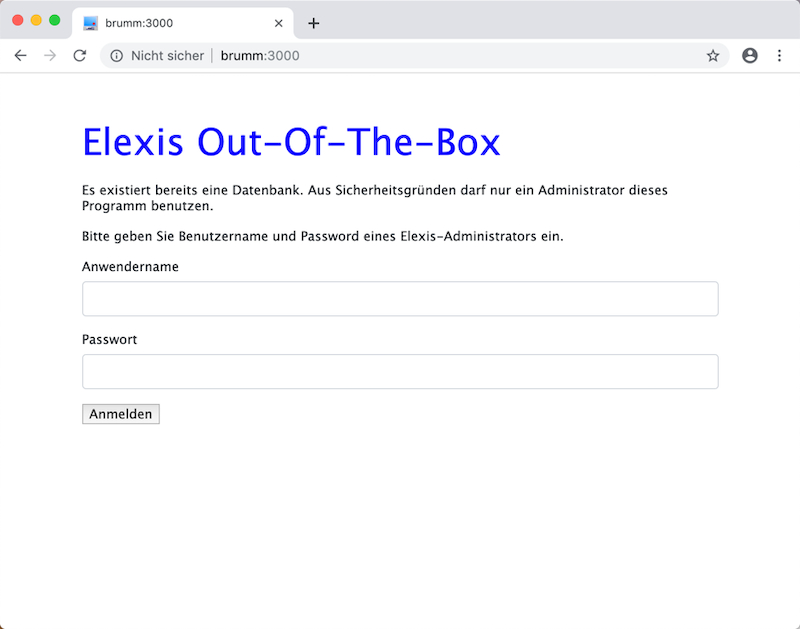
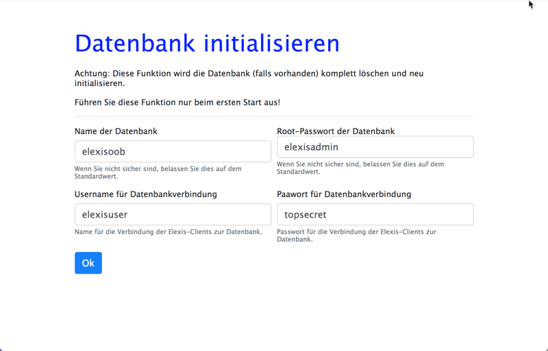
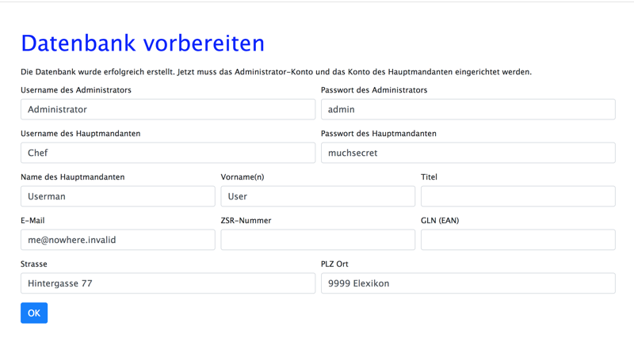
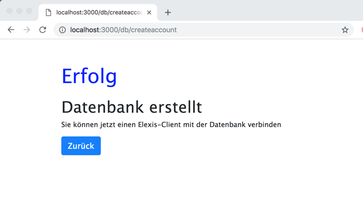
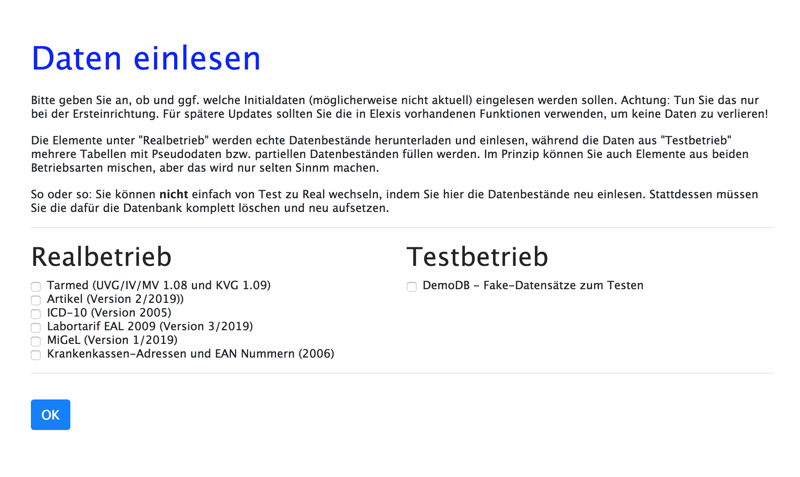
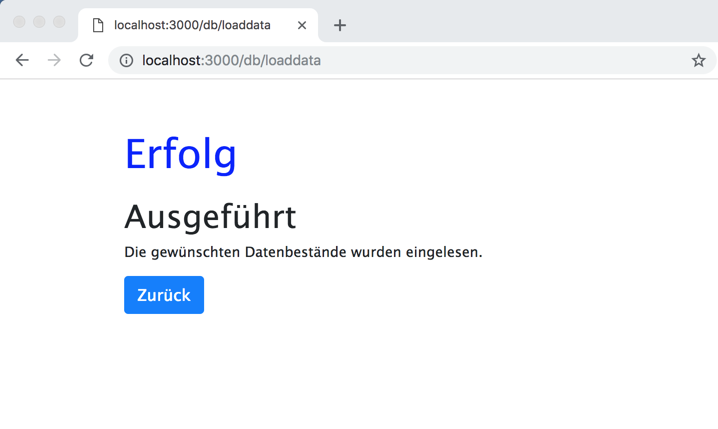

# Erstkonfiguration

Achtung: Diese Schritte müssen Sie nur durchgehen, wenn Sie Elexis erstmals installieren! Falls Sie eine bestehende Datenbank in elexis-oob einbinden, oder eine Datensicherung zurückspielen wollen, lesen Sie bitte bei 'Wiederherstellen'.

Ich gehe davon aus, dass Sie elexis-oob auf dem Server bereits gestartet haben. Gehen Sie nun an einen Client-Computer und starten Sie dort einen Web-Browser (am besten Chrome oder Firefox). Richten Sie diesen Browser auf <http://IhrServer:3000> (Wobei Sie für IhrServer entweder den Netzwerknamen des Servers oder dessen IP-Adresse angeben können). Folgendes Bild sollte Sie begrüssen:

Falls Sie schon eine Datenbank erstellt haben, werden Sie stattdessen dieses Bild sehen:

Dies ist ein Schutz, damit Unbefugte keine Manipulationen oder gar Beschädigungen der Daten verüben können. Sie müssen hier Benutzername und Passwort eines Anwenders eingeben, der in Elexis Administratorrechte hat. Falls Sie beim Einrichten einfach immer "ok" oder "weiter" geklickt haben, ist das Administrator/admin. Nachdem Sie die Demo-Datenbank eingelesen haben, ist es test/test. 

Wenn Sie erfolgreich eingeloggt sind, können Sie den folgenden Abschnitt übergehen und gleich bei "Basis Datenbestände einlesen" weitermachen.

Klicken Sie auf den Link "Datenbank initialisieren" im rechten unteren Bereich unter "Verwaltung". Der nächste Screen erscheint:

* Für den Namen der Datenbank können Sie etwas Beliebiges eingeben. Es muss allerdings ein Wort ohne Leerzeichen und Sonderzeichen sein, und es ist empfehlenswert, nur Kleinschreibung zu verwenden.

* Das Root-Passwort des Datenbankservers ist das, welches der Datenbankadministrator benötigt, um etwa neue User oder neue Datenbanken anzulegen. Falls Sie hier etwas Anderes als die Vorgabe eintragen wollen, müssen Sie auch den entsprechenden Eintrag (MYSQL_ROOT_PASSWORD) in docker-compose.yaml ändern und dann elexis-oob neu starten. Ich würde aber empfehlen, es für jetzt so zu lassen, und das Passwort des Datenbankadministrators dann am Ende der Ersteinrichtung in etwas zu ändern, was hier nirgends steht.

* Username und Passwort für die Datenbankverbindung sind die Angaben, mit denen Elexis-Clients sich mit der Datenbank verbinden müssen. Mit diesen Angaben erhalten die Clients nur Zugriff auf die Elexis-Datenbank.

Wenn alles in Ordnung ist, klicken Sie "OK".

Als nächstes wird die Elexis-Datenbank eingerichtet. Hier benötigen wir einen Administrator (der andere Anwender erstellen und ihnen Rechte zuteilen kann), und einen Hauptmandanten. Dieser Administrator ist nicht derselbe, wie der Datenbank-Administrator, den wir im vorigen Screen erstellt haben. Der Administrator hier ist für die Verwaltung von Elexis zuständig, der vorhin für die Verwaltung des Datenbankservers. (Selbstverständlich darf beides durchaus dieselbe Person sein, die entweder in die eine oder in die andere Rolle schlüpfen kann).

Hier können (und sollten!) Sie Angaben verwenden, die anders als die Vorgaben hier sind. Merken Sie sich aber gut den Usernamen und das Passwort des Administrators, sonst sperren Sie sich aus Elexis aus.

Klicken Sie dann auf "OK".

Die Datenbank ist eingerichtet. Ein Klick auf "Zurück" bringt Sie wieder zum Start-Bildschirm.

Jetzt können Sie, wenn Sie möchten, bestimmte Basis-Datenbestände in Ihre neue Elexis-Datenbank einlesen. Sie können dasselbe ohne Weiteres auch später von einem Elexis-Client aus machen, aber jetzt geht es schneller und einfacher. Dafür sind allerdings die Datenbestände möglicherweise nicht ganz aktuell. 

Klicken Sie dazu auf "Basis-Datenbestände einlesen" rechts unten unter "Verwaltung". Elexis-OOB zeigt Ihnen dann die Datenbestände, die direkt eingelesen werden können:

Beachten Sie, dass die Datenbestände auf der linken Seite für "echte" Datenbanken gedacht sind, während der Punkt "DemoDB" eine Fake-Datenbank einliest, die Sie zum Testen oder für Demonstrationszwecke verwenden können. Diese Datenbank enthält auch keine kompletten Datensätze etwa für Artikel oder Abrechnungspositionen. In diesem Fall müssen Sie sich in Elexis als user "test" mit dem Passwort "test" einloggen und haben dann auch Administrator-Rechte.

Kreuzen Sie einfach die Felder an, die Sie interessieren, und klicken Sie dann "OK".

Der Vorgang kann je nach gewählten Datenbeständen eine ganze Weile dauern und endet mit folgendem Bild:

Ein Klick auf "Zurück" bringt Sie wieder zum Startbildschirm.

Gehen Sie dann nochmal an die Konsole Ihres Servers und geben Sie dort ein: `docker-compose restart`, damit Elexis-OOB mit der eben erstellten Datenbank arbeitet.

Fahren Sie dann mit der Einrichtung der [Clients](clients.md) fort.
