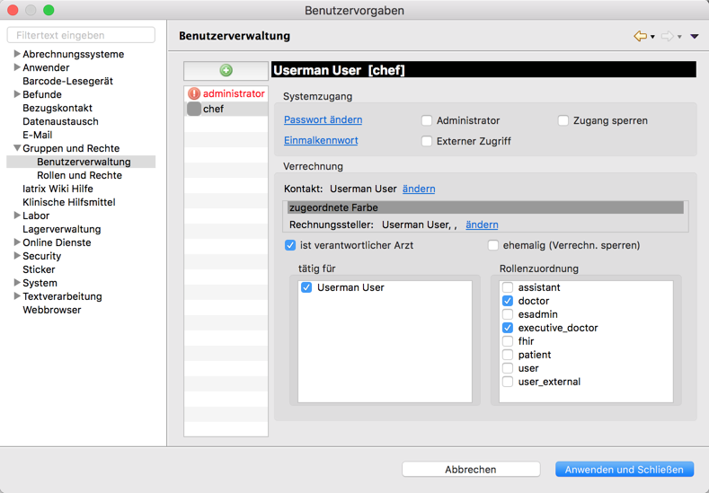

# Konfiguration von Elexis

Leider kann Elexis-OOB (noch) nicht alles für Sie erledigen, was für eine komplette Arztpraxisumgebung notwendig ist. 

Eine ausführlichere Anleitung dessen, was Sie nach der Installation von Server und Clients noch erledigen müssen, finden Sie bei [elexis.info](https://wiki.elexis.info/Installation_Elexis_3.x_OpenSource). Hier nur ein Schnelldurchgang, damit Sie gleich loslegen können.

## Benötigte Features nachinstallieren

Wählen Sie im Elexis-Hauptmenü den Punkt *Hilfe->Neue Software installieren*. Sie können eine der vordefinierten Sites auswählen, oder mit *Hinzufügen* beispielsweise eine oder mehrere der mit Elexis-OOB installierten Software-Sites hinzufügen.

Wählen Sie für jetzt die Site "elexis-3-base" und markieren Sie dort unter "Basispakete" das Paket "Elexis Swiss OpenSource Feature", und unter "Dokumentenverwaltung" das "Omnivore" Feature. Achten Sie darauf, dass Sie das Richtige erwischen, vgl. obiges Bild. (Keine Angst, Sie können später jederzeit weitere Features nachinstallieren, jetzt machen wir nur das Minumum, was zum Einrichten notwendig ist). 

Klicken Sie dann auf Weiter" und dann auf "Fertigstellen". Sie werden eine Sicherheitswarnung erhalten, die Sie mit "Trotzdem installieren" beantworten müssen. Danach sollten Sie Elexis neu starten.

## Mandanten und Anwender erstellen

Starten Sie Elexis und wählen Sie im Hauptmenü *Datei->Einstellungen*. Dort finden Sie folgende Seite:

Ernennen Sie Ihren vorhin erstellten Hauptmandanten zum "verantwortlichen" Arzt und weisen Sie ihm passende Rollen zu. (Durch "Rollen" wird festgelegt, wer in Elexis was tun darf - belassen Sie am Besten zunächst alles auf den Standardwerten).

Klicken Sie dann "Anwenden und Schließen".

## Abrechnungssystem konfigurieren

Öffnen Sie jetzt wieder den *Datei-Einstellungen* Dialog und suchen Sie diesmal *Abrechnungssysteme* auf. 

(Wenn Sie alles in der Reihenfolge wie hier gezeigt gemacht haben, sollten die in de Schweiz gebräuchlichen Abrechnungssysteme jetzt schon wie hier gezeigt vorkonfiguriert sein. Ansonsten können Sie mit Klick auf "Neu..." benötigte Abrechnungssysteme selber erstellen.)

Doppelklicken Sie auf das "KVG-Abrechnungssystem", resp. erstellen Sie ein solches:

Ergänzen Sie die Details wie hier gezeigt.

**Wichtig!**: Für den Multiplikator müssen Sie den für Ihren Kanton gültigen Taxpunktwert einsetzen!

Eine ausführlichere Erläuterung des Abrechnungssystems finden Sie [hier](https://wiki.elexis.info/Ch.elexis.base.ch.arzttarife).

Jetzt können wir loslegen. Einen Einstieg zeige ich [hier](elexis_how2.md)
