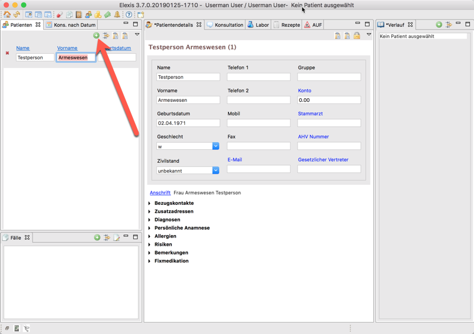
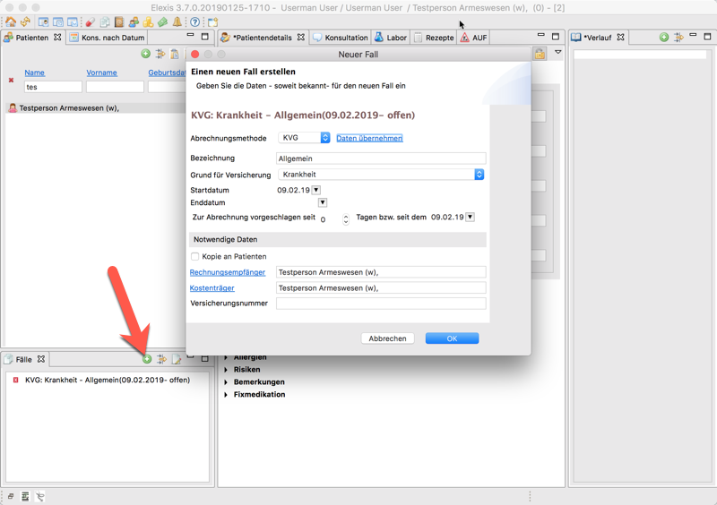
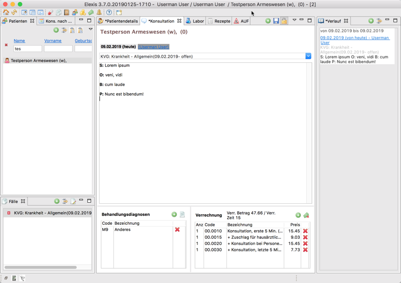

# Elexis benutzen

Wie jedes Arztpraxisprogramm hat auch Elexis eine gewisse Komplexität. Anders als etwa ein Textprogramm, muss eine Arztpraxis-Software ganz unterschiedliche Aufgaben erfüllen können, was die Anzahl der zu lernenden Vorgänge leider deutlich erhöht. Elexis-OOB bietet Ihnen eine einfache Möglichkeit, "schmerzlos" zu testen: Wenn etwas schief geht, haben Sie das System ja in wenigen Minuten wieder neu aufgesetzt. Und Sie können problemlos mehrere Elexis-OOB Instanzen nutzen, um etwa neue Plugins erst mal unabhängig vom eigentlichen Praxissystem zu testen.

Die Firma [Medelexis AG](https://www.medelexis.ch) bietet professionelle Unterstützung von Elexis und führt auch regelmässig Usertreffen und andere Veranstaltungen durch, bei denen Sie Kontakte mit Elexis und Elexis-Anwendern knüpfen können.

Es existiert auch eine Menge Dokumentation zu Elexis, die allerdings leider teilweise bereit etwas veraltet und nicht überall gut strukturiert ist. Dank der Arbeit von Niklaus Giger finden Sie aber auf [Elexis.info](http://www.elexis.info) eine umfangreiche und immer wieder aktualisierte Sammlung von Dokumenten aller Art.

Doch nun lade ich Sie ein, einfach mal ins kalte Wasser zu springen.

## Eine Patientin erstellen.

Stellen wir uns mal vor, eine bisher unbekannte Patientin wünscht telefonisch einen Termin. Wir haben noch keinerlei Angaben von ihr.

Tippen Sie im Elexis Hauptfenster links mindestens den Namen und vielleicht noch den Vornamen ein.

Klicken Sie dann auf das grüne (+) Symbol oben. Passen Sie in der dann öffnenden Dialogbox vielleicht noch das Geschlecht an, den Rest können Sie vorerst noch leer lassen. Nach Klick auf "OK" haben Sie im System eine neue Patientin erstellt.

## Fall und Konsultation erstellen

Nun erscheint die Notfallpatientin in der Praxis, aber sie hat keine Krankenkassenkarte dabei. Wir erstellen also einen unvollständigen Fall. Markieren Sie die vorhin erstellte Patientin und klicken Sie im Fenster "Fälle" auf das grüne (+) Symbol:

Die nun öffnende Dialogbox können Sie einfach so belassen. Wir haben einen Fall erstellt, bei dem die Patientin selbst sowohl Rechnungsempfänger als auch Kostenträger ist. Wenn sie später die Krankenkassenkarte bringt, können wir das ändern. Klicken Sie jetzt also einfach auf "OK".

Im Mittleren Fenster "Personalien" könnten Sie jetzt noch einige Angaben ergänzen, etwa Geburtsdatum und Telefonnummer, und unter "Anschrift" die Adresse. Doch nun wollen wir die Konsultation erfassen. Klicken sie auf den Reiter "Konsultation" und dort auf das grüne (+) Symbol.

Damit haben Sie eine Konsultation mit dem aktuellen Datum erstellt. Wenn Sie mit dem Entrag fertig sind, klicken Sie auf das (+) Symbol im Unterfenster "Verrechnung" und doppelklicken Sie auf die gewünschten Positionen, resp. ziehen Sie sie mit der Maus ins Verrechnungs-Fenster.

Schliesslich klicken Sie auf das (+) unter Behandlungsdiagnosen und wählen in gleicher Weise etwas Passendes aus.

Gratuliere! Sie haben Ihre erste Konsultation mit Elexis erstellt und verrechnet.

Damit ist der Crashkurs zu den Elexis-Basics beendet. Wenn Sie möchten, können Sie mit dem Dokumentenverwaltungs-System [Lucinda](lucinda.md), dem Web-Client [Webelexis](webelexis.md) oder der [Röntgenbild-Verwaltung](pacs.md) weiter machen.
