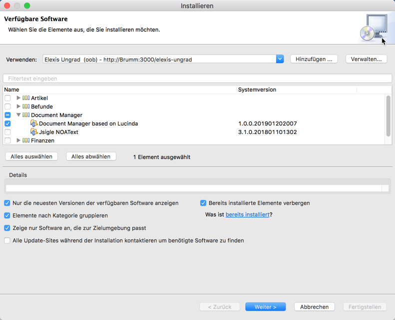
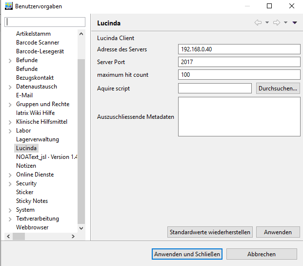
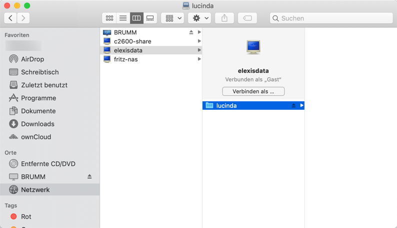
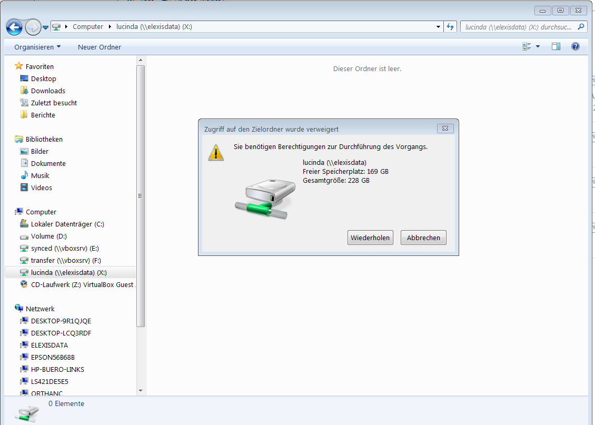
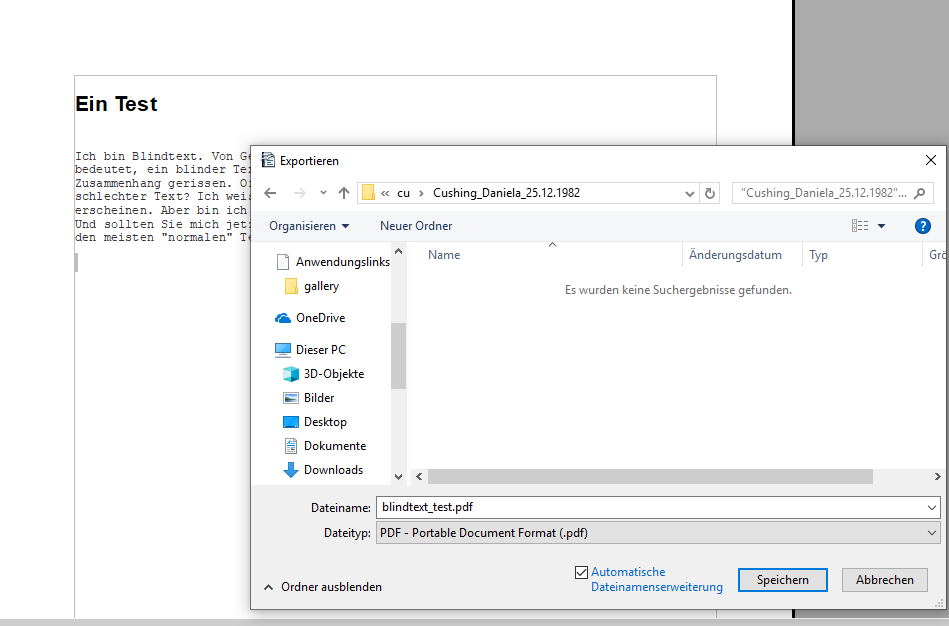
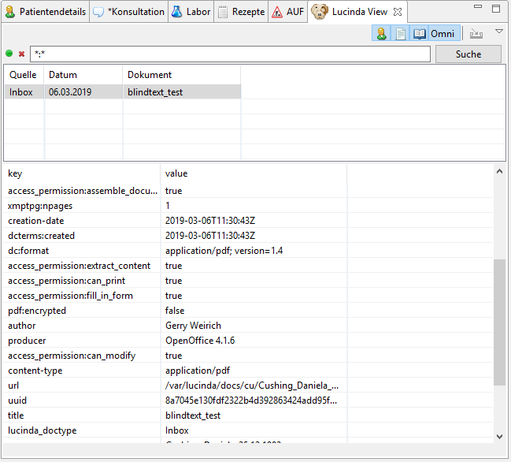
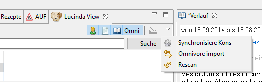

# Lucinda

Lucinda ist ein Dokumentenverwaltungssystem, welches mit Elexis-OOB bereits automatisch eingerichtet wurde. Ihr Elexis-Client kann über ein Plugin mit dem Lucinda-Server kommunizieren. Dieses Plugin müssen wir nun allerdings zunächst installieren. Es befindet sich im Repository "Elexis Ungrad", und es ist abhängig von einem weiteren Plugin: Omnivore.

Falls Sie bei der Einrichtung des [Elexis-Clients](elexis.md) nicht wie vorgeschlagen das Omnivore-Plugin installiert haben, müssen Sie das jetzt zunächst nachholen, damit das Lucinda-Plugin installiert werden kann.

Fügen Sie dazu das Ungrad-Repository hinzu, falls noch nicht geschehen.



Wählen Sie dann dort "Document Manager based on Lucinda" und klicken Sie "Weiter" und dann "fertigstellen". Starten Sie dann Elexis neu.


Nach dem Neustart müssen wir unter Datei-Einstellungen-Lucinda Ihren Arbeitsplatz mit dem Server bekannt machen. Gehen Sie dazu nach Datei->Einstellungen->Lucinda und geben Sie dort die passenden Zugriffsdaten ein:



Öffnen Sie dann die Lucinda-View und klicken Sie auf den roten Punkt, der sich grün färben wird, wenn die Verbindung erfolgreich war. 

Weiteres zur Konfiguration und Bedienung von Lucinda finden Sie [dort](https://elexis.ch/ungrad/features/lucinda/).


## Netzwerkerkennung

Wenn Sie, zum Beispiel mit einer Dokumentenscanner-Applikation, direkt ins Lucinda-Verzeichnis scannen wollen, dann benötigen Sie Netzwerkzugriff auf dieses Verzeichnis. 

### Mac-Clients

Sie finden das Lucinda Verzeichnis in der Netzwerkumgebung, sowohl unter dem Namen des Servers (hier "brumm"), als auch unter dem Namen "elexisdata":



### Linux-Clients

Je nach Distribution müssen Sie Samba installieren, um auf smb-shares zuzugreifen. Probieren Sie es einfach aus. Falls die Ressource 'elexisdata' nicht in der Netzwerkumgebung auftaucht, suchen Sie nach dem Namen des Servers. Oder stellen Sie die Verbindung manuell über die "Verbinde.." Option des Dateimanagers her, mit einer Anweisung wie:

```
smb://elexisdata/lucinda
```

### Windows Clients

Bei Windows 7 taucht das Lucinda-Dokumentenverzeichnis üblicherweise direkt in der Netzwerkumbegung auf. Bei Windows 10 leider des Öfteren nicht. Sie können die Verbindung aber manuell herstellen. Öffnen Sie in Windows eine Kommandozeile (cmd.exe) und geben Sie dort ein:

```
net use L: \\<IhrServer>\lucinda
```
Sie finden das Lucinda-Dokumentenverzeichnis dann unter L: (Wobei Sie für L: natürlich auch einen anderen freien Laufwerksbuchstaben eingeben können)

Manchmal müssen Sie stattdessen Folgendes eingeben: 

```
net use L: \\elexisdata\lucinda
```

### Schreibrechte
Das Speichern von Dokumenten im Lucinda-Dokumentenverzeichnis funktioniert in der derzeitigen Version von Elexis-OOB noch nicht direkt. Sie werden beim Versuch, dort etwas zu speichern, eine Meldung ähnlich wie diese erhalten:



Um das zu ändern, muss man zuerst Schreibrechte gewähren:


```
docker exec -it elx_samba /bin/sh
chmod -R 777 /mnt/lucinda
exit
```

Diesen Vorgang muss man nur einmal machen (allerdings natürlich jedes Mal, wenn man den Container mit den Lucinda-Daten neu erstellt).

## Dateien in Lucinda speichern

Dafür gibt es mehrere Möglichkeiten:

### Mit dem Dateimanager verschieben

Das Lucinda-Verzeichnis ist ein Verzeichis wie andere auch. Sie können einfach mit dem Dateimanager Dokumente dort hineinziehen. Lucinda wird (meistens) bemerken, dass etwas abgelegt wurde, und das Dokument indizieren.

### Direkt ins passende Verzeichnis scannen

Wenn Sie in den Lucinda-Einstellungen ein Aquire-Script oder Programm angegeben haben, dann ist der Button "import" in der Lucinda-Toolbar anwählbar und startet eben dieses Script. [Hier](https://elexis.ch/ungrad/reference/scanimage/) sehen Sie ein Beispiel, welches ein Dokument vom Scanner einliest, durch eine OCR schickt und direkt beim passenden Patienten in Lucinda speichert. Lucinda übergibt dem Script die Personalien des Patienten als ersten, den Titel des Dokuments als zweiten Parameter.

### Direkt ins passende Verzeichnis speichern

Wenn Sie ein Dokument, Email etc. in einem anderen Programm geöffnet oder erstellt haben, können Sie es direkt ins Lucinda-Verzeichnis speichern.



So oder so wird dann nach kurzer Zeit der entsprechende Text in Lucinda verfügbar sein. `*:*` findet alle Texte, Sie können aber auch nach irgendeinem Wort oder Wortkombination des Inhalts suchen (**+blind +text -wolke**) oder nach bestimmten Attributen (**+author:gerry +lastname:Cushing**). Die Attribute eines Texts finden Sie im unteren Teil des Lucinda-Fensters, wenn Sie den Text anklicken.



Diese Attribute werden teils von Lucinda, teils vom darunter liegenden [Apache Tika](http://tika.apache.org/) automatisch erstellt und sind je nach Dateityp teilweise unterschiedlich. Wenn Sie an manchen Attributen generell überhaupt nicht interessiert sind, können sie sie bei den Lucinda Einstellungen ausschliessen.

Wenn Sie einen gefundenen Text doppelklicken, wird er in einem separaten Fenster geöffnet (Sofern ein Programm installiert ist, das den betreffenden Dateityp darstellen kann)

### Rescan erzwingen

Meistens wird Lucinda nach einigen Sekunden "merken", wenn ein neues Dokument eingetroffen ist. Je nach Betriebssystem, Zahl der kurz nacheinander eingeleseneen Dokumente, Luftdruck und Horoskop manchmal aber auch nicht. Sie können sie dann bitten, mal nachzusehen:



Klick auf "rescan" im View-Menu bewirkt ein Neueinlesen der Dokumente. Man kann währenddessen durchaus weiterarbeiten, da der Prozess im Hintergrund auf dem Server abläuft. Ausserdem wird auch bei jedem Neustart (`docker-compose restart` oder `docker-compose restart lucinda`) alles neu eingelesen.


## Troubleshoot

Wenn der Knopf in der Lucinda-View einfach nicht grün werden will, findet der Lucinda Client offenbar den Server nicht.

Dafür kann es verschiedene Gründe geben. Starten Sie zunächst einen Web-Browser auf Ihrem Client Computer und surfen Sie zu:

http://elexisdata:2017/lucinda/2.0/ping

Als Antwort sollten Sie die Meldung "Welcome to Lucinde v 2.1.0" oder so ähnlich erhalten. Wenn Sie stattdessen bekommen: "Seite nicht gefunden" oder so, versuchen Sie statt 'elexisdata' den Namen oder die IP-Adresse des Servers, also etwas wie: `http://192.168.47.4:2017/lucinda/2.0/ping`. Wenn Sie auch damit keinen Erfolg haben, dann "sieht" entweder dieser Client den Server nicht (Testen Sie das mit `ping <serveradresse>` in einem Kommandozeilen-Fenster), oder der Lucinda Server ist nicht richtig gestartet.

Gehen Sie in diesem Fall an die Serverkonsole und versuchen Sie:

`sudo docker ps`

Unter den angezeigten Containern sollte auch elx_lucinda sein. Wenn nicht, starten Sie Elexis-OOB neu (`sudo docker-compose restart`). Wenn ja, versuchen Sie als nächstes:

`sudo docker logs elx_lucinda` und halten Sie Ausschau nach Fehlermeldungen. Starten Sie ggf. den Lucinda-Server neu (`sudo docker-compose restart lucinda`).

Wenn es immer noch nicht geht, melden Sie sich im [Bugtracker](https://github.com/rgwch/elexis-oob/issues) oder auf der elexis-developer Mailing liste. Vergessen Sie nicht, die Log-Datei mitzugeben (`sudo docker logs elx_lucinda>logdatei.txt`)

Beachten Sie bitte, dass es keinen garantierten Support für Lucinda (oder sonstige Teile von Elexis-OOB) gibt. Das Recht, es gratis zu benutzen, beinhaltet kein Recht, jemanden zu behelligen. Telefonieren ist nicht nur zwecklos, sondern weckt auch Aversionen. Mails sind besser. Bugtracker ist noch besser. Selbsthilfe und Rückmelden, wie man sich geholfen hat, ist am Besten.
