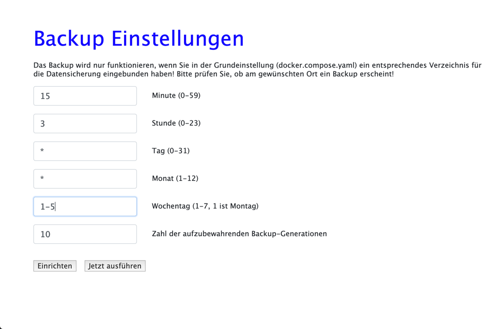
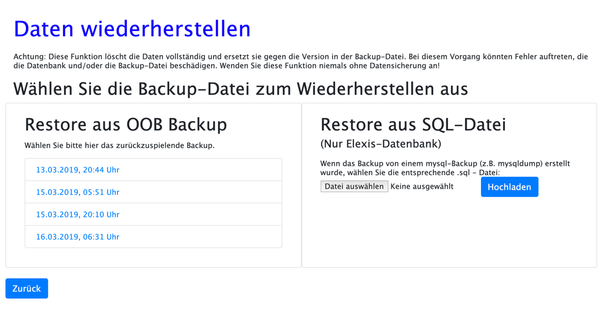
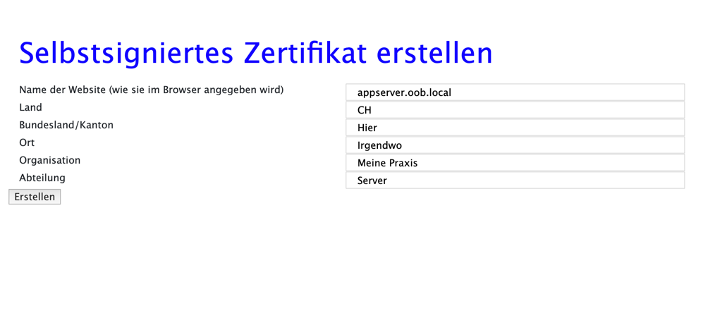
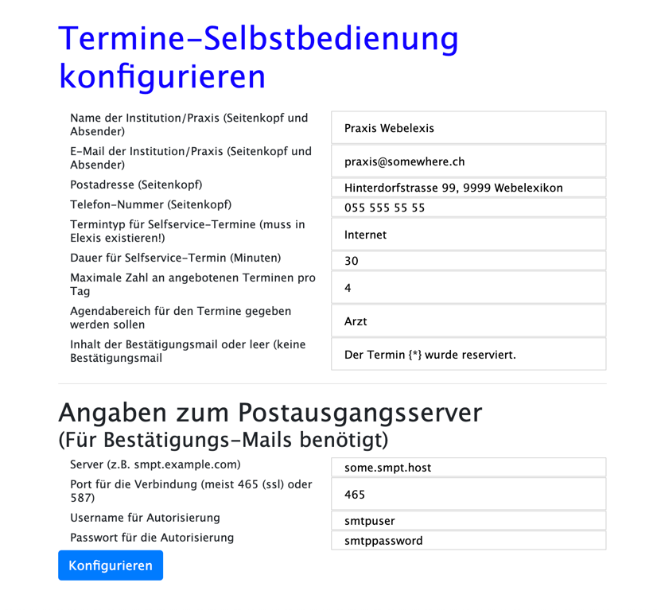

# Datenbank Verwaltungs Funktionen

Die Funktionen zum Einrichten der Datenbank und Einlesen von Datenbeständen haben wir ja bereits bei der [Ersteinrichtung](config.md) besprochen.

Elexis-OOB erlaubt Ihnen ausserdem, Sicherungen Ihrer Datenbank zu planen und wiederherzustellen.

*Achtung*: Sie sollten Ihre Datensicherung unbedingt in regelmässigen Abständen testen, etwa mit einer zweiten Elexis-OBB-Instanz, damit Sie erkennen, falls etwas nicht funktioniert!

## Backup

### Grundlagen

Zu grundsätzlichen Überlegungen zum Backup lesen Sie bitte [hier](backup.md)

Man kann eine Datenbank grundsätzlich auf zwei Arten sichern:

1: Man kann das Verzeichnis, in dem die Daten auf der Festplatte physisch gespeichert sind, komplett sichern.

Vorteile: 

* Relativ schnelles Sichern und Wiedereinspielen
* Kann im Rahmen eines standardmässigen System-Backup-Konzepts eingebunden werden

Nachteile:

* Funktioniert nur mit derselben Datenbank, oft sogar nur mit derselben Version des Datenbankservers unter demselben Betriebssystem wie beim Backup. Das kann beim Versuch, ein länger zurückliegendes Backup wieder einzulesen, unlösbare Probleme machen.
* Funktioniert nur zuverlässig, wenn das Datenbank-Serverprogramm zum Zeitpunkt der Sicherung gestoppt ist, da sonst Inkonistenzen auftreten können (Wenn die Datenbank ein Objekt verändert, das gerade geichert wird.) Inkonistenzen bei der Sicherung können dazu führen, dass ein Wiedereinspielen unmöglich ist.


2: Man speichert das Backup als Folge von SQL-Befehlen (SQL-Script)

Das ist quasi die Simulation aller Vorgänge die auf die Datenbank von Anfang an bis zum derzeitigen Stand angewendet wurden.

Vorteile:

* Funktioniert meistens auch zwischen verschiedenen Versionen des Datenbankservers und sogar betriebsytemübergreifend: Sie können das backup Ihres Linux-servers auf Ihrem Windows-Laptop testen.
* Bei allfälligen Fehlern können SQL-Scripts, die im Grunde einfache Textdateien sind, zur Not sogar manuell korrigiert werden.

Nachteile:

* Diese Dateien sind grösser, als reine Kopien. Sowohl ihre Erstellung als auch das Wiedereinspielen dauert wesentlich länger.

Elexis OOB verwendet die erste Möglichkeit. Allerdings kann es systembedingt den Datenbankserver nicht stoppen. Sie sollten also den Zeitpunkt des Backups so legen, dass dann sicher keine Aktivität stattfindet. Und ich würde empfehlen, zusätzlich noch ein Backup nach der Methode 2 ausserhalb von Elexis-OOB anzulegen. Auf der [Backup-Seite](backup.md) finden Sie Beispiel-Skripte.

### Ausführung

Wählen Sie im Elexia-OOB Hauptbildschirm im Feld "Verwaltung" den Punkt "Datenicherung konfigurieren". Folgendes Fenster erscheint:



Die Angaben, die Sie hier eintragem können, sind im "crontab" Stil. Die Einstellungen in diesem Beispielbild bedeuten: Es wird Montag bis Freitag jede Nacht ab 03:15 Uhr ein Backup erstellt. Für jedes der Felder können Sie folgende Ausdrücke angeben:

* Ein Stern, **\***: Jede. Also jede Minute, jede Stunde, jeden Tag. 
* Eine Zahl, z.B. **5**: Immer die 5. Minute oder die 5. Stunde, der 5. des Monats, jeden Mai oder jeden Donnerstag. Achtung: Immer die 5. Minute ist *nicht* dasselbe wie "alle 5 Minuten". Immer die 5. Minute bedeutet: 5 nach Mitternacht, 5 nach 1, 5 nach 2 usw.
* Mehrere durch Komma getrennte Zahlen, z.B. **1,3,4** Jeweils die erste,dritte und vierte Minute/Stunde/Tag/Monat/Wochentag.
* Zwei durch Bindestrich verbundene Zahlen, z.B. **1-5** würde bei der Angabe zum Wochentag z.B. bedeuten: Jeden Tag Montag bis Freitag.
* Stern und Schrägstrich, z.B. **\*/10** meint "alle 10", also etwa alle 10 Minuten, alle 10 Stunden usw.

Dies sollte für den Alltag genügen. Falls Sie es noch genauer wissen wollen, können Sie bei Seiten, die sich mit cron oder der [crontab](https://www.linuxwiki.de/crontab) befassen, weiter lesen.

Als letztes Feld sollten Sie noch angeben, wie viele Generationen von Backups aufbewahrt werden sollen. Der Platz auf Ihrem primären Backupmedium wird begrenzt sein, und diese Datensicherungen können mit der Zeit sehr gross werden. Geben Sie hier z.B. 10 an, um jeweils nur die 10 neuesten Sicherungen aufzubewahren (zumindest einige von den Älteren sollten Sie zu diesem Zeitpunkt schon durch ein Stufe-2-Backup irgendwo anders hin gesichert haben).

Beachten Sie, dass von jedem Datentyp die genannte Zahl aufbewahrt wird. Also 10 Datenbanksicherungen, 10 Lucinda-Sicherungen, 10 PACS-Sicherungen usw.

### Ergebnis

Zum  Verständnis, *wo* diese Backups eigentlich landen, und was man dann damit tun kann, ist leider ein Verständnis der Docker-Interna notwendig. Standardmässig gehen die Backups in das Volume 'backup', das sich auf Linux Conputern in `/var/lib/docker/volumes/elexis-oob_backup` befindet. Sie können durch enstprechende Änderung der docker-compose.yaml ein anderes Backup-Verzeichnis anlegen. Wenn Sie zum Beispiel Backups auf das Laufwerk /mnt/grosseplatte schreiben wollen, dann müssten Sie den Abschnitt:


````yaml
appserver:
    build: ./appserver
    container_name: elx_appserver
    environment:
      - DBHOST=elexisdb
      - DBPORT=3306
      - PUBLIC_DBPORT=3312
      - HOST_HOSTNAME=<Server Name>
    volumes:
      - backup:/backup
      - webelexisdata:/mnt/webelexisdata
      - elexisdb:/mnt/elexisdb:ro
      - lucindadata:/mnt/lucindadata:ro
      - lucindabase:/mnt/lucindabase:ro
      - pacsdata:/mnt/pacsdata:ro
    restart: always  
    ports:
      - 3000:3000
    depends_on:
      - elexisdb
    labels: 
      - "traefik.frontend.rule=Host:elexisapps.docker.localhost"  
````

so ändern, dass in volumes steht:

````yaml
volumes:
      - /mnt/grosseplatte:/backup
      - webelexisdata:/mnt/webelexisdata
      - elexisdb:/mnt/elexisdb:ro
      - lucindadata:/mnt/lucindadata:ro
      - lucindabase:/mnt/lucindabase:ro
      - pacsdata:/mnt/pacsdata:ro
    
````
und dann das System mit `docker-compose restart` neu starten.

Die Backups sind komprimierte Dateien mit Namen wie: `elexisdb_YYYY-MM-DD-HHmm.tar.gz`.
 
## Wiederherstellung aus Backups

Um ein mit Elexis-OOB erstelltes Stufe-1-Backup wiederherzustellen, gehen Sie so vor:

Wählen Sie im Elexis-OOB Hauptfenster rechts unten die Option 'Daten aus Backup wiederherstellen':



Im linken Feld sehen Sie alle mit OOB erstellten Backups, im rechten Feld haben Sie ausserdem die Möglichkeit, die Elexis-Datanbank (und nur die) aus einer SQL-Datei wiederherzustellen, wie sie zum Beispiel mit dem Programm mysqldump erstellt wurde.

Wir beschränken uns hier auf die OOB Backups. Wenn Sie eines der gezeigten Backups anklicken, erscheint das folgende Bild:


Nehmen Sie diese Warnung durchaus ernst. Beim Wiederherstellen werden zunächst alle existierenden Daten gelöscht und dann die Daten aus dem Backup dorthin geschrieben. Genäss Murphy sind immer dann die Backup-Daten defekt, wenn man sie dringend braucht und keine Alternative hat.

Grundsätzlich sollten Sie sich ein von Elexis-OOB unabhängiges Backup-System einrichten lassen und parallel auch dieses nutzen. Denken Sie daran, dass Ihnen niemand garantieren wird, dass ein bestimmtes Datensicherungssystem im Ernstfall auch funktioniert (auch ich garantiere nichts). Sie sollten jedes Backup-System hin und wieder testen, indem sie Sicherungen auf eine andere Elexis-OOB-Instanz einspielen und ausprobieren, ob dort dann alles funktioniert.

Als mindest-Vorsichtsmassnahme würde ich kontrollieren, ob auf dem backup-Laufwerk noch genügend Platz frei ist, dann noch einmal ein Backup von den aktuellen Daten erstellen, dabei genau auf allfällige Fehlermeldungen achten, und erst dann das gewünschte Backup einspielen. 

Ausserdem sollten Sie unbedingt sämtliche Elexis- und Webelexis-Clients im Netzwerk stoppen.

Der restore-Prozess kann einige Zeit dauern.

## Zertifikat erstellen und Schlüsselpaar installieren

Die Grundlagen zur verschlüsselten Kommunikation in Elexis-OOB sind in den  Kapiteln [Feinabstimmung](finetune.md) und [TLS/SSL](tls.md) beschrieben. Wenn Sie so wie dort beschrieben vorgegangen sind, können Sie ohne Weiteres direkt mit: `https://webelexis.nuno` verschlüsselt auf Ihre Dienste zugreifen.

Die Option "Selbstsigniertes Zertifikat" erstellen kann Ihnen helfen, für jeden Dienst ein eigenes Zertifikat zu erstellen, das dann anstelle des Traefik-Standard-Zertifikats angeboten wird:



Wichtig ist an sich nur die erste Zeile. Hier muss der Name des Dienstes so stehen, wie er später im Browser aufgerufen werden soll, und wie Sie ihn in [Feinabstimmung](finetune.md) unter "Service Namen" eingerichtet haben. Bei den anderen Zeilen können Sie eingeben, was Sie wollen; der Anwender sieht diese Angaben beim Überprüfen des Zertifikats.

Klicken Sie dann auf 'Erstellen' und gehen Sie für die anderen Dienste gleich vor. Danach müssen Sie OOB mit `docker-compose stop` und `docker-compose up -d`  neu starten. 

ACHTUNG: Es genügt <em>nicht</em>, einfach 'docker-compose restart' einzugeben, da die Container nicht nur neu gestartet, sondern mit den neuen Parametern neu erstellt werden müssen.

Wenn Sie Zertifikat und privaten Schlüssel von anderer Stelle bezogen haben, dann können Sie diese mit "Schlüsselpaar installieren" für Elexis-OOB verwendbar machen. Beachten Sie, dass der Name jeweils dem Namen des Dienstes entsprechen muss, und die Endung muss "crt" für das Zertifikat und "key" für den privaten Schlüssel sein. Also etwa 'appserver.nuno.crt' und 'appserver.nuno.key'.

## Termine-Selbstbedienung konfigurieren

Hier haben Sie die Möglichkeit, das Verhalten der [Termin-Selbstbedienung](http://www.webelexis.ch/dox/selfschedule.html) zu steuern. Die grundsätzliche Einrichtung ist [hier](https://elexis.ch/oob/doc/#!letsencrypt.md) und [hier](http://webelexis.ch/dox/selfschedule.html) beschrieben. 



Hier definieren Sie das Aussehen der Seite, die man bei der Terminreservation zu sehen bekommt. und die Daten des SMTP-Servers, der benötigt wird, um Bestätigungs-Mails zu versenden.
