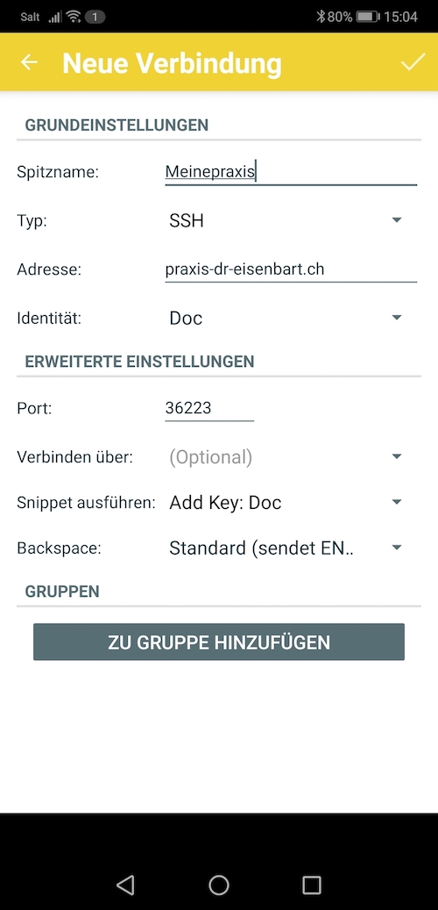
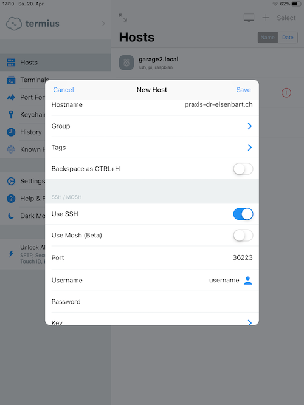

# Aus der Ferne via Internet auf die Praxisdaten zugreifen

Der Bedarf, zum Beispiel von zuhause aus auf die Praxisdaten zugreifen zu können, oder beispielsweise die Terminvergabe an eine externe Person zu delegieren, ist zweifellos da. Etliche Anwender haben dafür Verbindungen über eine Remote-Desktop-Software wie TeamViewer oder AnyDesk eingerichtet. Eine solche Verbindung hat mehrere Nachteile:

* Die Geheimhaltung der Daten ist nicht gewährleistet. Alle Daten laufen über einen Server des betreffenden Unternehmens und können dort im Prinzip auch gelesen werden. Das ist für Arztpraxis-Software schlicht unzulässig.

* Es muss ein Computer mit Elexis eigens zu diesem Zweck laufen gelassen werden, und dieser Computer muss von aussen erreichbar sein. In den Aufzeichnungen kann man nicht erkennen, ob ein bestimmter Zugriff von Ausserhalb oder über die Konsole dieses Computers erfolgt ist. Ein unbeaufsichtigt laufender Computer in der Praxis ist eine Schwachstelle. Der einzige Computer, der immer und unbeaufsichtigt läuft, sollte der Server sein, und auf diesem sollte keine Elexis-Instanz (am Besten überhaupt keine grafische Oberfläche) aktiv sein.

Ich werde in diesem Kapitel zeigen, wie man einen sicheren Zugang auf einen Server erstellt, und diesen abgesichert mit einem Computer oder einem Mobilgerät übers Internet nutzen kann.

## Secure Shell

Ich würde ganz grundsätzlich empfehlen, den Zugriff von aussen nur via SSH (secure shell) oder allenfalls VPN (Virtual Private Network) zu erlauben. Beide Technologien leisten im Wesentlichen Folgendes:

* Sie identifizieren den Benutzer auf sichere und vielfach erprobte Weise. Dabei kann optional (und empfehlenswert) ein digitales Schlüsselpaar statt eines Passworts verwendet werden, was deutlich mehr Sicherheit bietet.

* Der Administrator kann einen Zugang jederzeit sperren, wenn zum Beispiel ein Mitarbeiter die Praxis verlässt oder ein Schlüssel verloren ging, etwa weil der Laptop oder das Handy gestohlen wurde.

* Sie sorgen dafür, dass die gesamte Kommunikation sicher verschlüsselt stattfindet.

Für beide Technologien gibt es quelloffene, seit Jahrzehnten bewährte und immer wieder verbesserte Programme, so dass man davon ausgehen kann, dass die Zahl sowohl der unentdeckten Fehler als auch der von Dritten eingeschleusten Hintertüren vergleichsweise klein sein dürfte - Natürlich sind solche Fehler oder Hintertüren niemals ganz sicher auszuschliessen, aber bei proprietären und vergleichsweise neuen Produkten wahrscheinlicher, als bei openSSH und openVPN. 

SSH ist einfacher aufzubauen, als VPN, daher werde ich mich hier auf SSH beschränken.

## Server

Auf einem Linux Server ist der SSH daemon (sshd) üblicherweise bereits vorinstalliert und läuft. Wenn nicht, können Sie ihn jederzeit aus den Paketquellen nachinstallieren (Debian/Ubuntu: `sudo apt-get install openssh-server`, Arch/Manjaro: `sudo pacman -S openssh`, Alpine: `sudo apk add openssh`). Auf einem Mac wird er idR ebenfalls schon vorinstalliert sein, andernfalls können Sie ihn z.B. via [Homebrew](https://brew.sh) nachinstallieren (`brew install openssh`). Neuere Windows-Versionen stellen ihn ebenfalls direkt zur Installation bereit (s. hier: <https://docs.microsoft.com/en-us/windows-server/administration/openssh/openssh_overview>). Für ältere Windows-Varianten kann man ihn z.B. via [Cygwin](https://www.cygwin.com) installieren.

Sie können alle Einstellungen in /etc/ssh/sshd_config auf den Voreinstellungen belassen, nur die Einstellung "PasswordAuthentication" sollten Sie für die Einrichtung auf "yes" lassen und dann für den Alltagsgebrauch auf "no" stellen. Ich zeige den Grund gleich.

Erstellen Sie auf dem Server für jeden Anwender, der SSH-Zugriff erhalten soll, ein Benutzerkonto. Im Prinzip können Sie auch Sammel-Benutzerkontos erstellen, etwa "mpa" für alle MPAs, es ist dann aber schwieriger, Einzelnen den Zugriff wieder zu entziehen.

## Router

Damit Ihr Server aus dem Internet erreichbar ist, müssen Sie auf dem Router eine Portweiterleitung einstellen. Ich würde empfehlen, einen nicht-Standard-Port für den Fernzugriff zu wählen, da Sie sonst Dauerziel für Brute-Force-Attacken werden, die zwar, sorgfältige Einrichtung vorausgesetzt, nicht wirklich gefährlich sind, aber Netzwerk und Router belasten können. Nehmen wir an, Sie wählen (willkürlich) den Port 36223, dann müssten Sie eine Portweiterleitung von 36223 auf dem Router auf 22 auf dem Server einrichten (Die externe Portnummer kann irgendeine Zahl zwischen 1025 und 65535 (2^16) sein), die nicht von einem anderen Dienst bereits verwendet wird. Wenn Sie unbedingt wollen, können Sie auch eine Zahl unter 1025 wählen, kommen dann aber eher mal Standardanwendungen in den Weg oder werden von Hackern behelligt, die solche Standardanwendungen angreifen wollen). Ich wähle für diese Anleitung überall den Port 36223 als Beispiel, aber das heisst keineswegs, dass Sie auch diesen Port verwenden sollten.

## DNS

Wenn Sie wollen, dass Ihr Server nicht nur unter der IP-Adresse (z.B. etwas wie 11.21.234.17), sondern auch unter einem symbolischen Namen (etwas wie praxis-dr-eisenbart.ch) erreichbar ist, dann müssen sie ihn dem DNS-System bekannt machen. Wie das geht, habe ich an [anderer Stelle](letsencrypt.md), Abschnitt 1 und 2,  gezeigt. (Den Teil mit den Zertifikaten brauchen Sie hier nicht zu beachten, da wir für den SSH Zugang kein Webserver-Zertifikat verwenden müssen).

## Client

Grundsätzlich kann man sich bei SSH mit Username/Passwort einloggen, oder mit einem digitalen Schlüsselpaar. Letzteres ist sicherer, da ein ausreichend langer Schlüssel mit heutiger Technik nicht knackbar ist, während Passwörter oft zu kurz und zu leicht erratbar gewählt werden. Bedenken Sie, dass ein Angreifer beliebig oft beliebige Passwörter ausprobieren kann, solange Ihr SSH-Zugriff offen ist, und dass er das meist nicht von Hand tut, sondern mit Programmen, die Tag und Nacht viele Versuche pro Sekunde laufen lassen können. Ich empfehle daher, ausschliesslich die schlüsselbasierte Authentisierung anzuwenden und den Schlüssel mit einem Passwort zusätzlich zu sichern, falls das Endgerät einmal in falsche Hände geraten sollte. 

Im Folgenden zeige ich die Einrichtung von Clients auf Linux, macOS, Android, iOS und Windows-Geräten. Im Abschnitt für Linux/Mac werden die technischen Details genauer erörtert, so dass Sie vielleicht diesen Abschnitt in jedem Fall durchlesen möchten-

### Linux und Mac

Erstellen Sie ein Schlüsselpaar mit `ssh-keygen -t rsa`.  Das Programm wird Sie fragen, wohin Sie den Schlüssel speichern wollen. Wenn dies sowieso Ihr einziger ssh-Schlüssel ist, können Sie die Vorgabe belassen (macOS: /Users/username/.ssh/id_rsa, linux: /home/username/.ssh/id_rsa). Andernfalls geben Sie einen anderen Pfadnahmen an, ich würde aber empfehlen, als Speicherort den Ordner .ssh in Ihrem Heimatverzeichnis zu belassen. Also z.B. /Users/ihrname/.ssh/praxis_key. Dann möchte das Programm ein Passwort oder einfach Eingabetaste, um den Schlüssel ohne Passwort zu speichern. Ich würde empfehlen, ein Passwort einzugeben, für den Fall, dass mal Unbefugte an den Computer kommen.
Wohlbemerkt: Hier geht es nicht um das Passwort für den Zugriff, sondern nur um ein Passwort, mit dem der eigentliche Schlüssel auf dem lokalen Computer gesichert wird. Daher sind hier die Anforderungen auch nicht so hoch, und dieses Passwort darf ruhig relativ "banal" sein. Es muss keinen automatisierten Knackprogrammen standhalten, sondern nur Eintippen an der Tastatur, und auch das nur so lang, bis der Zugriff auf dem Server gesperrt wird. Wählen Sie einfach etwas, was man nicht gleich erraten kann.

Wenn es erfolgreich durchgelaufen ist, hat ssh-keygen einen öffentlichen Schlüssel (id_rsa.pub, resp. praxis_key.pub) und einen privaten Schlüssel (id_rsa resp. praxis_key) erstellt. Nun müssen wir den öffentlichen Schlüssel auf den Server hochladen. Der private Schlüssel bleibt immer auf dem lokalen Computer. Bei jeder Verbindungsaufnahme wird der Server den Client auffordern, eine bestimmte Zeichenfolge mit dem privaten Schlüssel zu verschlüsseln und kann dann mit dem öffentlichen Schlüssel prüfen, ob der Client wirklich den passenden privaten Schlüssel hat. Diese Vorgänge übernehmen die beteiligten Programme transparent für Sie; Sie müssen nur den Schlüssel bereitstellen.

Am einfachsten laden Sie den öffentlichen Schlüssel mit `ssh-copy-id -p 36223 username@praxis-dr-eisenbart.ch` auf das Konto 'username' des Praxisservers hoch. Dazu werden Sie das Passwort des Loginkontos von 'username' eingeben müssen, und der Server muss zu diesem Zeitpunkt auch noch "PasswordAuthentication yes" in der Konfiguration haben.

Sie können das natürlich auch manuell erledigen: Der öffentliche Schlüssel muss in die Datei ~/.ssh/authorized_keys auf dem Server eingefügt werden. Anleitungen dazu finden Sie im Netz.

Die Verbindungsaufnahme erfolgt dann mit `ssh -p 36223 -i ~/.ssh/praxis_key username@praxis-dr-eisenbart.ch`. Dieses Kommando sollte Sie nach dem Passwort des Schlüssels fragen. Wenn dies die erste Verbindung zu diesem Server ist, werden Sie ausserdem gebeten, zu bestätigen, dass die Identität des Servers stimmt. Sie können das mit dem Key Fingerprint überprüfen, allerdings ist die Wahrscheinlichgkeit, dass just jetzt zum Zeitpunkt der Einrichtung Ihres Fernzugriffs, eine Man-In-The-Middle-Attack stattfindet, auch relativ gering. Trotzdem: Vertrauen ist gut, Kontrolle ist besser. Diese direkte 1:1 Bestätigung tritt bei SSH an die Stelle der Zertifikate, die Sie beim Einrichten von [TLS/SSL](tls.md) gesehen haben. Bei SSH benötigen wir keinen Dritten, der uns die Rechtmässigkeit eines Schlüssels bestätigt, dafür müssen wir aber bei der ersten Verbindungsaufnahme selbst Verantwortung für diesen Schlüssel übernehmen.

Wenn Sie die Identität des Servers mit "yes" bestätigen, wird SSH Sie ohne weitere Fragen in ein Konsolenfenster auf dem Server führen.

Das genügt aber noch nicht. Wir wollen ja einen Zugriff auf mysql bzw. Webelexis haben. Dazu müssen wir eine sogenannte 'Portweiterleitung' oder 'port forwarding' einrichten. Genau: Etwas Ähnliches, was Sie bereits beim Router gemacht haben. Nur dass jetzt der SSH Server die Rolle des Routers übernimmt und der SSH Client die Portweiterleitung dynamisch erstellen kann. Man kann eine solche Weiterleitung ebenfalls auf der ssh Kommandozeile einrichten, aber ich würde ein einfacheres Vorgehen empfehlen: 

Schliessen Sie zunächst die vorhin hergestellte Konsolenverbindung wieder mit 'exit'.

Erstellen Sie dann im Verzeichnis .ssh in Ihrem Heimatverzeichnis eine Datei namens 'config' mit folgendem Inhalt:

```
Host praxis
    HostName praxis-dr-eisenbart.ch
    User username
    Port 36223
    LocalForward 3307 127.0.0.1:3306
    LocalForward 2018 127.0.0.1:2018
    IdentityFile /Users/username/.ssh/praxis_key        
```

Die Einrückung nach der ersten Zeile ist relevant. Natürlich müssen Sie für HostName, User, Port und Identityfile die bei Ihnen zutreffenden Angaben einsetzen. Falls Sie ein Programm wie Windows-Notepad oder den Mac Texteditor verwenden, müssen Sie darauf achten, dass das Programm nicht "heimlich" eine Endung wie .txt anfügt resp. diese Endung wieder entfernen, Die Datei muss einfach 'config' heissen und in reinem Text-Format sein.

Dann können Sie zukünftig einfach mit `ssh praxis` die Verbindung herstellen. Danach geht folgendes:

* Sie können eine lokale Elexis-Instanz mit dem Server localhost, Port 3307 verbinden und Elexis starten.

* Sie können mit einem Webbrowser auf http://localhost:2018 gehen, um Webelexis zu starten. 

In beiden Fällen wird ssh die Verbindung automatisch und unsichtbar auf den Praxisserver umleiten. Das Einzige, was Sie bemerken werden ist eine geringere Geschwindigkeit insbesondere bei Elexis, das nicht gut für langsame Verbindungen geeignet ist. Der Browser wird bei Webelexis zwar "nicht sicher" monieren (weil es keine TLS-Verbindung ist), aber da irrt er sich: Die http-Verbindung wird ja durch den SSH-Tunnel geleitet, ist also sehr wohl verschlüsselt und gesichert.

Vielleicht noch eine Klärung zur Portweiterleitung: Sie haben im Abschnitt "Router" eine Portweiterleitung von Ihrem Router zum Server eingerichtet, in unserem Beispiel von Router:36223 auf Server:22. Aber der SSH-Server, der an Port 22 sitzt, macht seinerseits Portweiterleitungen von 2018 auf 2018 und von 3306 auf 3307. Muss man dann nicht auch diese Ports am Router freischalten? Nein. Die Verbindung zwischen SSH Client und SSH Server geht vollständig durch einen "Tunnel", das ist ein verschlüsselter Datenstrom, der hier via Port 36223 geführt wird und alles andere, inklusive Endanwender-Ports beinhaltet. Die Zerlegung in einzelne Ports findet erst beim SSH Server statt. Sie könnten in 'config' auch beliebige weitere Ports definieren, wenn Sie auch Daten für andere Anwendungen durch den Tunnel senden wollen. Und Sie könnten auch Weiterleitungen zu anderen Computern im Praxis-Netzwerk einrichten. 

### Android

Ich zeige hier das Vorgehen für die App 'JuiceSSH', die Sie vom Playstore herunterladen können. Es gibt viele andere SSH clients für Android; möglicherweise ist das Vorgehen dort anders.

* Gehen Sie nach dem Start vonm JuiceSSH auf 'Verbindungen' und dort auf 'Identitäten'. Berühren Sie das '+' unten rechts, um eine neue Identität zu erstellen. Erstellen Sie für diese Identität ein neues Schlüsselpaar:


Klicken Sie dann auf OK und geben Sie den usernamen auf dem Server und ev. das Kennwort ein.


Wenn Sie die Kaufversion von JuiceSSH haben, können Sie untern auf "Snippet erstellen" klicken, um das Hochladen des öffentlichen Schlüssels zu automatisieren.

* Erstellen Sie eine neue Verbindung für Ihre Praxis und ordnen Sie dieser Verbindung die vorhin erstellte Identität zu.



Vergessen Sie nicht, auf das Häkchen rechts oben zu drücken, um die Verbindung zu speichern.

* Als Letztes müssen wir noch die Port-Weiterleitung einrichten (Die Theorie dazu habe ich weiter oben unter "Linux" beschrieben).


Wenn Sie jetzt die SSH Verbindung in JuiceSSH öffnen, wird direkt der Browser mit Webelexis gestartet. Allerdings hat Webelexis in der derzeitigen Version noch keine gute Darstellung für kleine Mobilbildschirme. Wählen Sie in den Browser-Optionen die "Desktop-Version" an, um damit arbeiten zu können.

### iOS

Für iOS zeige ich hier 'Termius', die Sie aus dem App-Store laden können. Aber natürlich gibt es auch viele andere SSH Clients, die Sie verwenden können.

* Erstellen Sie eine neue Verbindung:



* Klicken Sie unten auf 'key' um einen Schlüssel zu erstellen:


Speichern Sie den Schlüssel und dann die Verbindung mit "save".

 Wenn Sie die bezahlte Version von Termius haben, können Sie auch hier ein "startup snippet" erstellen, das den public key zum Server hochlädt und in authorized_keys installiert. Ansonsten müssen Sie das manuell tun. Termius hilft dabei aber, so dass das keine Hexerei ist: 
 
 

 Gehen Sie auf den tab "keychain", wählen Sie den Schlüssel und klicken Sie "export". Wenn der Server zu diesem Zeitpunkt noch Passwort-Login erlaubt, wird der Schlüssel so direkt hochgeladen und in authorized_keys eingefügt. (Sie müssen nur darauf achten, jeweils die richtigen Passwörter einzutippen: Einmal will er das Passwort für den Schlüssel, dann das fürs Login)

Zukünftig gelingt das Login dann einfach nur mit Eingabe des Schlüssel-Passworts.

* Dann müssen wir noch das Port Forwarding einrichten (Die Theorie dazu habe ich oben im Abschnitt 'Linux' beschrieben):


Erstellen Sie eine "New Rule":


Geben Sie dort die passenden Daten und die dazugehörige Verbindung ein, und Sie haben es geschafft: Künftig können Sie direkt unter "Port Forwarding" die Verbindung zu Ihrer Praxis öffnen, und dann mit dem Web-Browser auf localhost:2018 surfen. 


### Windows

Unter Windows erledigen Sie die SSH-Verbindung am besten mit dem Programm [Putty](https://www.chiark.greenend.org.uk/~sgtatham/putty/latest.html). Sie benötigen eigentlich nur "putty.exe" und "puttygen.exe", nicht den kompletten Installer.

* Erstellen Sie ein Schlüsselpaar mit puttygen.exe


Speichern Sie den privaten Schlüssel an einem Ort, den Sie später wiederfinden, zum Beispiel als 'praxis_key.ppk'. Den öffentlichen Schlüssel können Sie auf einem tragbaren Medium speichern, oder per strg+X aus dem oberen Feld ausschneiden. Dieser muss nach '~/.ssh/authorized_keys' auf dem Server.

* Erstellen Sie eine neue Verbindung in putty.exe.


Speichern Sie die Verbindung.

* Geben Sie die benötigten Daten ein (Zur Theorie, siehe den Abschnitt unter "Linux".)

Username eingeben: 


Privaten Schlüssel angeben:


Tunnels (= port forwarding) konfigurieren:


Vergessen Sie nicht, am Ende wieder zur Anfangsseite (Session) zurückzukehren, und die Verbindung nochmal zu speichern, wenn Sie alles eingegeben haben. Sonst "vergisst" Putty es bis zum  nächsten Mal wieder.

Von da an können Sie einfach auf die gespeicherte Session doppelklicken, um die Verbindung zu Ihrer Praxis erzustellen. Sie können dann entweder eine Elexis-Verbindung zu localhost auf Port 3307 oder eine Browser-Verbindung zu localhost auf Port 2018 herstellen, die von putty zum SSH Server der Praxis durchgeleitet wird.


## Absichern

Wenn die Schlüsselerstellung auf allen SSH-berechtigten Computern  aller zugelassenen Anwender durchgeführt wurde, sollte man auf dem Server in /etc/ssh/sshd_config die Zeile PasswordAuthentication auf 'no' setzen und den SSH Server mit `sudo service sshd restart` bzw. `sudo systemctl restart sshd` neu starten. Von da an ist der Zugriff nur noch via Schlüssel möglich.

