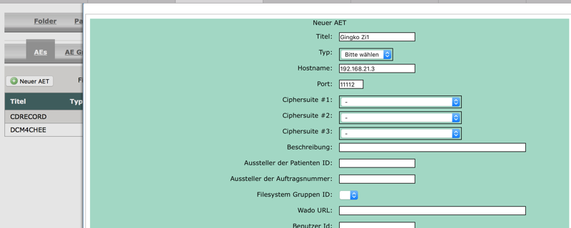

# PACS

Dies ist kein Teil von Elexis, sondern ist hier nur dabei, weil ein PACS (Picture Archiving and Communication System) heute mit dem Übergang von analogen zu digitalen Bilden zum immer wichtigeren Teil der Praxis-Software wird. Das PACS, das bei Elexis-OOB integriert wird, ist eine dockerisierte Version von [DCM4CHEE](https://www.dcm4che.org). Das Image, welches DCM4CHEE mit einem JBoss Applikationsserver und einer Mysql-Datenbank kombiniert, stammt von [sparklyballs](https://hub.docker.com/r/sparklyballs/pacs). Das alles braucht Sie nicht allzu sehr zu interessieren, denn es wurde von elexis-oob bereits fertig eingerichtet und konfiguriert.

## Erstkonfiguration

Richten Sie einen Browser auf http://&lt;Server&gt;:8101/dcm4chee-web3. Loggen Sie sich ein (username: admin, password: admin) und ändern Sie als erstes im Menü "Benutzer" das Admin-Passwort. Ausserdem ist es empfehlenswert, für die normale Nutzung einen weiteren User-Account hinzuzufügen, der keine Admin-Berechtigungen hat.

Dann müssen Sie zugriffsberechtige AE's (Application Entities) definieren. Bei einem PACS können nur Geräte miteinander kommunizieren, die einander gegenseitig bekannt gemacht wurden. Zunächst benötigen Sie einen Dicom Viewer für Ihre Client-Computer. Hier einige Vorschläge (Ohne Anspruch auf Vollständigkeit):

* Linux: [Gingko](http://ginkgo-cadx.com/en/)

* macOS: [Osirix](https://www.osirix-viewer.com), [Miele LXIV](https://itunes.apple.com/us/app/miele-lxiv/id988332475?mt=12), [Horos](https://horosproject.org), [Gingko](http://ginkgo-cadx.com/en/)

* Windows: [K-PACS](http://www.k-pacs.de/), [Synedra](http://download.synedra.com/download.php), [RadiANT](https://www.radiantviewer.com), [Gingko](http://ginkgo-cadx.com/en/)

Installieren Sie den Viewer auf dem Client und geben Sie als Daten für den Server an: Die Adresse des Servers, auf dem das PACS gestartet wurde, und als Port: 11114. Gehen Sie dann wieder zur DCM4CHEE Konfiguration und wählen Sie im Menu *AE* den Eintrag: "Neuer AET". Dort genügt es, die ersten drei Einträge auszufüllen:

Für den Hostnamen können Sie entweder den symbolischen Netzwerknamen oder die IP Adresse einsetzen. Mit Klick auf "Echo" können Sie testen, ob die Geräte einander wirklich "sehen". Klicken Sie dann auf "Speichern".

Das war's eigentlich schon. Sie können jetzt sowohl eigene Röntgenbilder, als auch Bilder von externen Instituten auf Ihrem eigenen PACS abspeichern und abrufen. Je nach DICOM Software können Sie auch alte analoge Röntgenbilder scannen (oder einfach abfotografieren), "dicomisieren" und ins PACS schieben. 

Allerdings sollten Sie beachten, dass weder die hier vorgestellte Software noch normale Computermonitore für die Befundung von Röntgenbildern zugelassen sind. Für die Befundung sollten Sie sich immer an den Monitor begeben, der zu Ihrer digitalen Röntgenanlage gehört.

