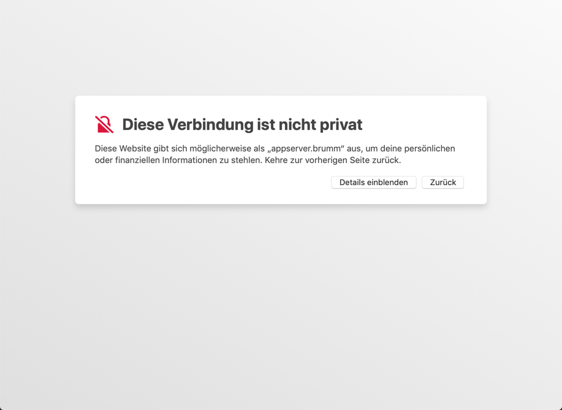

# TLS/SSL Verschlüsselung

## Prinzip

Das Konzept basiert auf dem Prinzip der asymmetrischen Verschlüsselung, welches ursprünglich 1977 von Rivest, Shamir und Adleman entwickelt und nach ihren Anfangsbuchstaben RSA-Verfahren genannt wurde. Dabei hat man einen privaten Schlüssel, den man geheim hält und einen öffentlichen Schlüssel, der allgemein bekannt sein darf bzw. soll. Wenn nun Alphons eine Nachricht an Berta senden will, dann verschlüsselt er diese mit Bertas öffentlichem Schlüssel. Berta wiederum kann die Nachricht mit ihrem privaten Schlüssel (und nur mit diesem!) entziffern. Dadurch kann Alphons, ohne dass er den privaten Schlüssel von Berta kennen muss, oder ohne dass man, wie bei symmetrischen Verschlüsselungsverfahren üblich, einen Schlüssel "irgendwie" austauschen muss, sicher verschlüsselte Nachrichten senden. Und wenn Berta antworten will, verwendet sie einfach Alphons' öffentlichen Schlüssel und dieser kann mit seinem privaten Schlüssel entschlüsseln.

Eine zweite damit zusammenhängende interessante Möglichkeit ist folgende: Alphons kann seine Nachricht vor dem Verschlüsseln "signieren". Das bedeutet, er erstellt eine Prüfsumme über die Nachricht und verschlüsselt diese Prüfsumme mit seinem eigenen privaten Schlüssel. Dann verschlüsselt er die Nachricht zusammen mit der Signatur mit Bertas öffentlichem Schlüssel. 

Berta entschlüsselt die Nachricht zunächst mit ihrem eigenen privaten Schlüssel und entschlüsselt anschliessend die Signatur mit Alphons' öffentlichem Schlüssel. Dann bildet sie selber eine Prüfsumme über die Nachricht und kontrolliert, ob diese Prüfsumme dieselbe ist wie das, was in der Signatur steht. Wenn ja, ist die Nachricht garantiert von Alphons - zumindest wenn sicher ist, dass der zur Prüfung verwendete öffentliche Schlüssel wirklich von Alphons stammt. 

Genau hier liegt eine Angreifbarkeit dieses Verfahrens: Wenn Cäsar die Nachrichten zwischen Alphons und Berta abhören will, dann kann er eine "man in the middle attack" versuchen: Er generiert ein eigenes Schlüsselpaar, und jubelt beiden Partnern jeweils seinen eigenen öffentlichen Schlüssel als den des eigentlichen Partners unter. Dann kann er Alphons' Nachricht entschlüsseln, neu signieren und mit Bertas echtem öffentlichen Schlüssel an diese weiterleiten. Sie "meint" Alphons' öffentlichen Schlüssel zu haben, hat aber den von Cäsar und merkt so nicht, dass die Nachrichten abgehört oder sogar gefälscht werden.

Man kann diese Gefahr begrenzen, indem man die öffentlichen Schlüssel über einen anderen Kanal selber austauscht, oder indem man eine Prüfsumme (einen sogenannten 'key fingerprint') über den öffentlichen Schlüssel so publiziert, dass jeder die Echtheit nachprüfen kann. Das bedeutet aber einen zusätzlichen Schritt, den jeder Anwender machen müsste, was in der Praxis unrealistisch ist - Sicherheit muss automatisch erfolgen, sonst funktioniert sie nicht auf Dauer. Daher verwendet man im Internet ein automatisiertes Authentisierungssystem, das ich im nächsten Abschnitt zeigen werde.

## Implementation der TLS/SSL Verschlüsselung im Internet

Wenn ein Browser eine verschlüsselte Verbindung mit einem Webserver aufnehmen will, dann "spricht" er ihn mit https:// statt http:// an und wählt standardmässig den Port 443 statt 80. Zunächst verlangt er vom Server dessen öffentlichen Schlüssel, dann generiert er einen "session key", einen zufälligen Schlüssel für ein symmetrisches Verfahren, verschlüsselt diesen Schlüssel mit dem eben erhaltenen öffentlichen Schlüssel des Servers und schickt ihn zurück. Von da an kennen beide den session key, und die weitere Kommunikation wird mit diesem session key symmetrisch verschlüsselt. Dies deshalb, weil symmetrische Verfahren effizienter und schneller sind, als asymmetrische Verfahren - nur der Austausch des Schlüssels ist kritisch und dieses Problem hat die asymmetrische Verschlüsselung ja gelöst. 

Ich habe hier bewusst etwas vereinfacht: Client und Server müssen sich über verschiedene andere Dinge, zum Beispiel die zu verwendenden Verschlüsselungsalgorithmen, einigen. Etwas viel Wichtigeres habe ich aber auch weggelassen: Bei oben skizzierter Methode hat der Client keine Chance zu erkennen, wer der Server wirklich ist. Er könnte sich "meineBank.de" nennen, in Wirklichkeit aber zu "boeserhacker.com" gehören. Der öffentliche Schlüssel enthält per se keine nachprüfbare Identität. Dann würde die Kommunikation zwar perfekt verschlüsselt ablaufen, aber leider mit dem falschen Adressaten!

Dieses Problem wird mit Zertifikaten gelöst: Wenn eine vertrauenswürdige Stelle bestätigt, dass der öffentliche Schlüssel wirklich zu "meineBank.de" gehört, dann kann man das so weit glauben, wie man der Zertifizierungsstelle vertraut. Es gibt eine ganze Reihe solcher Zertifizierungsstellen, und die Browser- und Betriebssystemhersteller bemühen sich, deren Vertrauenswürdigkeit auf hohem Niveau zu halten. Ein Zertifikat kann zum Beispiel so aussehen (Sie erhalten es, wenn Sie im Browser bei einer https-Verbindung auf das Symbol links neben der Adresse klicken):

 
Hier bestätigt also die SwissSign AG, dass die Website zkb.ch der Firma 'Zürcher Kantonalbank' gehört, und dass der Server, mit dem ich derzeit verbunden bin, dieses Zertifikat besitzt: Der öffentliche Schlüssel, den diese https-Verbindung verwendet, wurde mit dem privaten Schlüssel von SwissSign signiert, was mein Browser wiederum mit dem öffentlichen Schlüssel von SwissSign prüfen kann (und er tut das auch jedesmal). Aber woher weiss ich, dass der öffentlich Schlüssel von SwissSign wirklich der SwissSign AG gehört? Ganz einfach: Der ist natürlich auch signiert. Von einer "höheren" Zertifizierungsstelle. Auf diese Weise kann man sich durch eine Kette von Zertifikaten (certificate chain) weiter hangeln, bis man ganz oben bei einem "root certificate"  angelangt ist. Und diese root-certificates sind fest im Browser gespeichert, können einem also nicht von Bösewichtern untergejubelt werden. Natürlich ist diese Zertifikatskette trotzdem ein Schwachpunkt des Ganzen. Es wurde zum Beispiel bekannt, dass manche Browser Root-Zertifikate eingebaut hatten, die unter Kontrolle der NSA standen, so dass diese jede Verschlüsselung kompromittieren konnte, indem sie sich für irgendeinen Server ausgab und dessen Zertifikat mit der eigenen Zertifizierungsstelle signierte.
Aber es ist immer noch die sicherste bekannte Möglichkeit, verschlüsselt und authentisiert zu kommunizieren. 
 
Wichtig ist auch zu wissen, dass die Zertifizierungsstelle nicht etwa die Schlüssel herstellt. Das tut man immer auf dem eigenen Computer, und der private Schlüssel sollte diesen nie verlassen. Man schickt nur den öffentlichen Schlüssel zum Signieren an die Zertifizierungsstelle. Dazu muss man dieser in irgendeiner, je nach Zertifikatstyp mehr oder weniger aufwändigen Form beweisen, dass man wirklich der Inhaber der zu schützenden Website ist. Also auch die Zertifizierungsstelle bekommt den privaten Schlüssel nicht zu Gesicht, kann die Verschlüsselung also nicht ohne Weiteres knacken.
 
In manchen Fällen genügt dieses Ein-Weg-Vertrauen nicht. Manchmal muss auch der Server genauer wissen, wer der Client ist. Dann kann er auch vom Client ein Zertifikat anfordern und überprüfen. Das ist aber nur selten der Fall. Meistens wird der Client einfach über eine Passwortabfrage authentisiert, welche über die bereits mit TLS verschlüsselte Verbindung erfolgt.

## Zertifikat-Sicherheit und Warnungen

Ein Sonderfall ist das sogenannte self signed certificate, also ein selbstsigniertes Zertifikat. Das ist ein Zertifikat, das sich selbst bestätigt, vertrauenswürdig zu sein. Was es natürlich idR nicht ist. Ausser, wenn wir es selbst hergestellt, aber aus praktischen oder finanziellen Gründen nicht von einer offiziellen Zertifizierungsstelle absegnen liessen. Genau das geschieht auch, wenn Sie ohne weitere Vorbereitungen wie in [Feinabstimmung-Verschlüsselte Verbindungen](finetune.md) gezeigt, eine https:// Verbindung zu einem Elexis-OOB Dienst aufbauen. Der reverse Proxy von Elexis-OOB stellt dann für Sie ad hoc ein selbstsigniertes Zertifikat her.

Aus obigem sollte nun aber klar sein, dass das Zertifikat nichts über die Sicherheit der Verschlüsselung aussagt, sondern nur über die Vertrauenswürdigkeit des öffentlichen Schlüssels. 
Das ist wichtig, um entsprechende Browser-Warnungen zu verstehen. Diese können je nach Betriebssystem und Browsertyp sehr unterschiedlich sein.

Hier beispielsweise die Warnseite von Safari unter macOS:

Um dennoch weiterzugehen, müssen Sie "Details einblenden" und dann ganz unten auf "öffne diese Website" klicken. Danach kommt noch einmal eine Warnung, die Sie mit "Website besuchen" bestätigen müssen.  Und dann will macOS Ihren Fingerabdruck bzw, Ihr Admin-Passwort, um die "Einstellungen für vertrauenswürdige Zertifikate" zu ändern. Immerhin: Danach hat er sich die Einstellung gemerkt und vertraut fortan diesem Zertifikat für diese Site.

Chrome unter macOS zeigt dieses Bild:

Hier müsen Sie auf "Erweitert" klicken und dann auf "weiter zu ... (unsicher)". Dann geht es ohne weitere Nachfrage zur Site. Allerdings merkt sich Chrome die Ausnahme nicht: Bei einer nächsten Verbindung müssen Sie die Warnung erneut abnicken. Ausser, Sie haben unter macOS zuvor mit Safari die Einstellungen geändert: Ein Zertifikat, dem Safari sein Vertrauen ausgesprochen hat, wird auch von Chrome akzeptiert.

Firefox schliesslich begrüsst uns auf dem Mac so:

Hier muss man auf "Erweitert" klicken und dann auf "Risiko akzeptieren und fortfahren". auch Firefox merkt sich die Erlaubnis zwar nicht von selbst, respektiert aber die persistierte Erlaubnis von Safari (resp. der System-Schlüsselbundverwaltung, die das im Hintergrund erledigt).

## Vertrauenswürdige Zertifikate

Wie oben gezeigt, kann man relativ leicht eine verschlüsselte Kommunikation einrichten.

Trotzdem ist es natürlich unschön, wenn wir jedesmal, wenn wir auf unseren eigenen Server zugreifen, den Browser beruhigen und überreden müssen, uns durchzulassen. Um dieses Problem zu umgehen, gibt es verschiedene Möglichkeiten, die allerdings leider sehr verschieden je nach Betriebssystem und Browser sind. Einige Hinweise:

### Selbstsigniertem Zertifikat das Vertrauen aussprechen

* Manche Browser erlauben, Sicherheitsausnahmen dauerhaft zu speichern, und dann für dasselbe Zertifikat keine Warnung mehr auszugeben. 

* Bei manchen Betriebssystemen können Sie manuell das Vertrauen zu einem Zertifikat erklären (bei macOS zum Beispiel mit der Schlüsselverwaltung des Systems)

* Bei manchen Betriebssystemem können Sie auch manuell Root-Zertifikate installieren, mit denen Sie eigene Zertifikate signieren und damit das Vertrauen erklären können. Bei Ubuntu zum Beispiel müssen Sie dazu nur das eigene root-Zertifikat nach /usr/local/share/ca_certificates kopieren und dann eingeben `sudo update-ca-certificates`.

* Etwas ausführlichere Erläuterungen zu diesem Problemkreis finden Sie z.B. hier: <https://tarunlalwani.com/post/self-signed-certificates-trusting-them/>

### Offizielle Zertifikate erwerben/beziehen

Man kann natürlich auch den "offiziellen" Weg gehen. Und der sieht vor, dass man sich die Echtheit eines selbst erstellten Schlüssels von einer derjenigen Stellen zertifizieren lässt, die bei den Browsern bereits als vertrauenswürdig eingebaut sind, oder die selbst von solchen "root-certificates" zertifiziert sind. Bis vor wenigen Jahren musste man dazu in die Tasche greifen: Zertifikate waren nur im Jahresabo zu haben und kosteten je nach Sicherheitsstufe von einer handvoll Dollars bis einigen hundert Dollars pro Jahr. Mit "Sicherheitsstufe" ist dabei gemeint, wie genau die Zertifizierungsstelle die Echtheit überprüft. Der Browser zeigt die Sicherheitsstufe eiunes Zertifikats durch die Art des Symbols in der Titelzeile an (von einem schlichten grauen Schloss bis zu einem breiten grünen Balken). Wobei noch einmal wiederholt werden muss: Diese Sicherheitsstufe hat nichts mit der Sicherheit der Verschlüsselung zu tun, sondern nur mit der Sicherheit der Identität. In der niedrigsten Stufe muss man nur beweisen, dass man Administratorzugriff auf die  Website hat, die man sichern will, in der höchsten Stufe muss man der Zertifizierungsstelle z.B. einen Ausweis oder einen Handelsregisterauszug vorweisen.

Seit einigen Jahren gibt es mit [Let's Encrypt](https://letsencrypt.org) eine Möglichkeit, kostenlos Zertifikate zu beziehen. Man muss dazu nur beweisen, dass man die Website. die man sichern will, manipulieren kann, Das lässt sich ohne weiteres automatisiert machen. Es gibt fertige Docker-Lösungen, die Let's Encrypt Zertifikate vollautomatisch anfordern, verwalten und regelmässig erneuern können (Let's Encrypt Zertifikate sind immer nur 3 Monate lang gültig). Eine Methode zeige ich im Kapitel über die [Absicherung des Termindienstes](letsencrypt.md).

