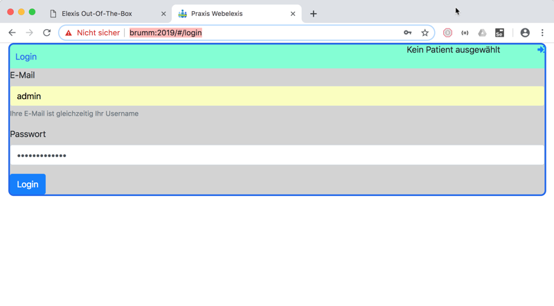

# Webelexis

## Start

Klicken Sie im Elexis-OOB Startfenster auf "Webelexis", oder richten Sie direkt einen Browser (am Besten Chrome oder Firefox) auf http:&lt;IhrServer&gt;:2019. Dieses Fenster sollte aufgehen:

Die unschöne Warnung "nicht sicher" von Chrome können Sie für den Moment ignorieren, da wir hier eine reine inhouse-Anwendung haben. Wir werden später sehen, wie das besser abgesichert werden kann, falls ein Zugriff von aussen ermöglicht werden soll. 

Ihr Username ist derselbe, den Sie für Elexis angegeben haben. Wenn Sie die Demo-Datenbank eingelesen haben, ist das **test** mit dem Password **test**.

Eine weitere Möglichkeit ist "admin", mot dem Passwort, das Sie bei der [Konfiguration](config.md) für den Administrator angegeben haben. (Wenn Sie alles einfach weitergeklickt haben (was Sie bei einem "echten" System niemals tun sollten), dann lautet dieses Passwort schlicht: **admin**)

Wenn alles geklappt hat, befinden Sie sich dann im Hauptbildschirm von Webelexis. Wie Sie von dort aus weitermachen können, lesen Sie am besten auf [Webelexis.ch](http://www.webelexis.ch/dox)